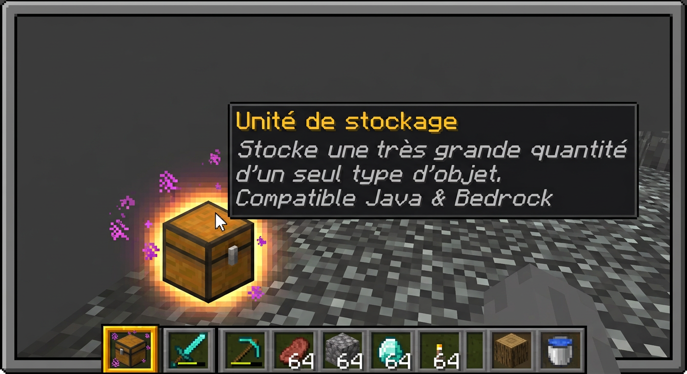
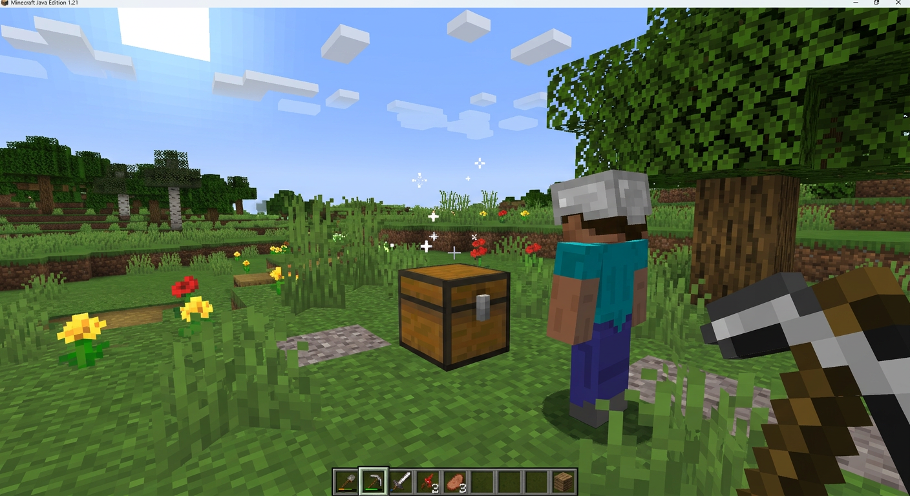
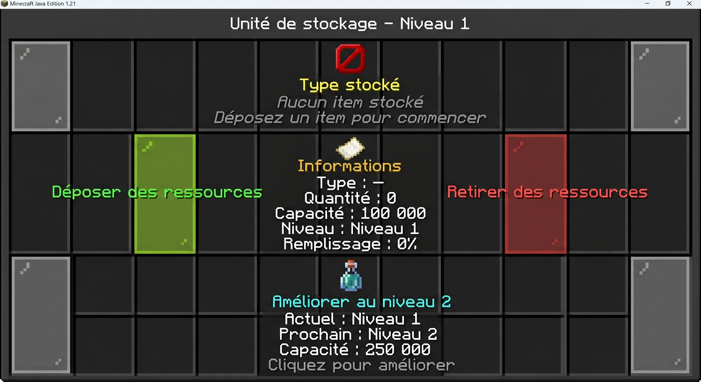
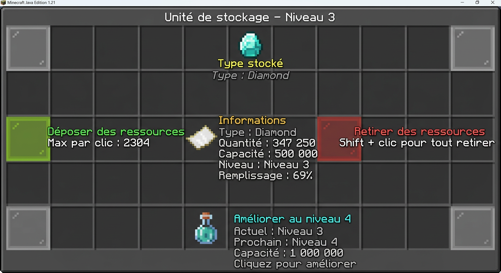

# Storage Units

Plugin **Paper / Purpur 1.21.11+** (Java 21) qui ajoute des coffres « Unités de stockage ».
Une unité ne stocke qu'**un seul type d'item** à la fois, mais en très grande quantité
(plusieurs millions possible). Compatible avec les joueurs **Java** et **Bedrock**
passant par Geyser/Floodgate, car :

* le bloc posé est un vrai `CHEST` vanilla, visible de la même manière des deux côtés ;
* l'interface graphique est une `Inventory` Bukkit standard, rendue nativement par les deux clients ;
* tous les textes utilisent **Adventure**, supporté identiquement par les deux pipelines.

## 📥 Téléchargement

**Dernière release stable : v1.0.0**

- 🔗 **Page des releases** : https://github.com/Souxch06/Storage_Units/releases
- 📦 **Téléchargement direct du JAR** : [StorageUnits-1.0.0.jar](https://github.com/Souxch06/Storage_Units/releases/download/v1.0.0/StorageUnits-1.0.0.jar)

```bash
wget https://github.com/Souxch06/Storage_Units/releases/download/v1.0.0/StorageUnits-1.0.0.jar -O plugins/StorageUnits-1.0.0.jar
```

> ✅ JAR compilé automatiquement via GitHub Actions (Java 21, Paper API 1.21.11+). Vérifiez toujours que vous téléchargez depuis la page officielle des releases.

---

## 📸 Aperçu visuel

### L'item « Unité de stockage » dans l'inventaire


### Le bloc coffre placé dans le monde


### L'interface — unité vide (Niveau 1)


### L'interface — unité remplie


---

## ✨ Fonctionnalités

* 📦 Bloc coffre custom — Un seul type d'item à la fois
* 📈 Système d'**amélioration par niveau** (1 → 5+ configurable)
* 💾 Persistance YAML (un fichier par unité + un index)
* 🔌 API publique (pour d'autres plugins)
* ⚙️ 100 % configurable (capacités, items, sons, recettes, messages)
* 🔊 Sons Minecraft vanilla (configurables)
* 🧰 Recettes de craft configurables (YAML) — **désactivées par défaut**
* 🪪 Item clairement identifiable dans l'inventaire (nom « ✦ Unité de stockage » + lore + glow + tag PDC) — **distinct d'un coffre vanilla**
* 🌐 Bloc posé = coffre vanilla, donc **identique sur Java & Bedrock**

---

## 🏗️ Architecture

```
fr.souxch06.storageunits
├── api                       API publique (pour plugins tiers)
│   ├── StorageUnitsApi
│   └── StorageUnitSnapshot
├── bootstrap
│   └── StorageUnits          Classe principale (onEnable / onDisable)
├── commands
│   └── StorageUnitCommand    /su, /storageunits
├── config
│   ├── ConfigManager         config.yml
│   ├── LanguageManager       lang/*.yml
│   └── RecipeConfig          recipes.yml
├── data
│   └── StorageRepository     YAML par unité
├── gui
│   └── StorageGui            Inventaire 27 cases
├── listeners
│   ├── UnitBlockListener     Casse, piston, explosion
│   ├── UnitInteractionListener  Clic droit + GUI
│   └── UnitItemListener      Placement de l'item
├── manager
│   └── StorageManager        Logique métier
├── model
│   ├── StorageLevel          Niveau d'unité (capacité)
│   └── StorageUnit           Modèle de l'unité
└── util
    ├── ItemUtil              Couleurs Adventure, names
    ├── PluginKeys            NamespacedKeys
    └── UnitItemFactory       Fabrique d'item
```

---

## 🚀 Compilation

```bash
mvn clean package
```

Le jar prêt à l'emploi est dans `target/StorageUnits-1.0.0.jar`.

> 💡 Vous pouvez aussi récupérer le JAR déjà compilé depuis la [dernière release](https://github.com/Souxch06/Storage_Units/releases/latest) :
> https://github.com/Souxch06/Storage_Units/releases/download/v1.0.0/StorageUnits-1.0.0.jar

---

## 📥 Installation

1. Copier le jar dans `plugins/` de votre serveur **Paper 1.21.11+** ou **Purpur 1.21.11+**.
2. Redémarrer le serveur.
3. Les fichiers `config.yml`, `lang/fr.yml`, `recipes.yml` sont générés dans `plugins/StorageUnits/`.

### Mise à jour

1. Arrêtez le serveur.
2. Remplacez le jar existant dans `plugins/` par la nouvelle version.
3. Redémarrez le serveur.

> ⚠️ **Ne supprimez pas `plugins/StorageUnits/` pendant une mise à jour.** Ce dossier contient
> votre configuration ainsi que les données persistantes de vos unités dans `units/`.

---

## 🎮 Utilisation

| Commande | Description | Permission |
|---|---|---|
| `/su give` | Donne une unité au joueur courant. | `storageunits.give` |
| `/su give <joueur> [niveau]` | Donne une unité à un joueur. | `storageunits.give` |
| `/su status` | Affiche le statut global. | `storageunits.use` |
| `/su list [page]` | Liste les unités chargées. | `storageunits.use` |
| `/su craft` | Affiche l'état du système de craft. | `storageunits.use` |
| `/su reload` | Recharge la configuration. | `storageunits.admin` |

**Placez** ensuite l'item coffre reçu. Un coffre vanilla est posé et marqué
via le PDC. **Clic droit** sur le coffre pour ouvrir l'interface :

* 🟩 Déposer : vide l'inventaire du joueur des items compatibles dans l'unité
* 🟥 Retirer : retire 1 stack (ou tout avec Shift)
* 🟪 Améliorer : passe au niveau supérieur (si configuré)

> 🪪 **Comment reconnaître une unité d'un coffre vanilla ?**
> L'item « ✦ Unité de stockage » se distingue par :
> - son **nom en or gras** avec le préfixe `✦`
> - son **lore** mentionnant « Storage Units » et la capacité
> - l'**effet brillant** (enchantement invisible)
> - le **tag PDC** `storageunits:unit_item` (côté serveur)
> Le bloc posé reste un coffre vanilla, pour rester visible à l'identique par Java et Bedrock.

---

## ⚙️ Configuration (`config.yml`)

```yaml
settings:
  language: "fr"
  default-level: 1
  max-stacks-per-click: 2304

levels:
  1: { capacity: 512,    display-name: "Niveau 1" }
  2: { capacity: 2048,   display-name: "Niveau 2" }
  3: { capacity: 8192,   display-name: "Niveau 3" }
  4: { capacity: 32768,  display-name: "Niveau 4" }
  5: { capacity: 131072, display-name: "Niveau 5" }

unit:
  material: CHEST
  name: "&6&lUnité de stockage"
  lore:
    - "&7Stocke une très grande quantité"
    - "&7d'un seul type d'objet."
  glowing: true
  custom-model-data: 0

sounds:
  open: BLOCK_CHEST_OPEN
  close: BLOCK_CHEST_CLOSE
  deposit: ENTITY_ITEM_PICKUP
  withdraw: ENTITY_ITEM_PICKUP
  upgrade: ENTITY_PLAYER_LEVELUP
```

### Ajouter un niveau

Il suffit d'ajouter une entrée dans `levels:` — **aucune modification de code n'est nécessaire** :

```yaml
levels:
  6:
    capacity: 25000000
    display-name: "Niveau 6 (Divin)"
```

### Recettes (`recipes.yml`)

**⚠️ Le craft est DÉSACTIVÉ PAR DÉFAUT** (config.yml → `craft.enabled: false`
et toutes les recettes du `recipes.yml` sont aussi à `enabled: false`).
Les développeurs / admins sont libres d'activer / désactiver / créer
les recettes qu'ils souhaitent.

Pour activer le craft :

1. Dans `config.yml` : passer `craft.enabled` à `true`.
2. Dans `recipes.yml` : passer la recette voulue à `enabled: true`.
3. `/su reload` (ou redémarrer le serveur).

```yaml
# config.yml
craft:
  enabled: true   # <- passer à true

# recipes.yml
recipes:
  basic_chest:
    enabled: true   # <- passer à true
    level: 1
    amount: 1
    shape:
      - "III"
      - "ICI"
      - "III"
    ingredients:
      I: IRON_INGOT
      C: CHEST
```

---

## 🔌 API publique

```java
import fr.souxch06.storageunits.api.StorageUnitsApi;
import fr.souxch06.storageunits.api.StorageUnitSnapshot;

StorageUnitsApi api = StorageUnitsApi.get();
if (api != null) {
    // Créer une unité à un emplacement
    java.util.UUID id = api.createUnit(loc, 1, player.getUniqueId());

    // Déposer / retirer
    api.deposit(id, itemStack);
    api.withdraw(id, player, 64);

    // Lister
    for (StorageUnitSnapshot s : api.listAll()) {
        plugin.getLogger().info("Unité " + s.id() + " -> " + s.amount());
    }
}
```

---

## 💾 Persistance

Les unités sont stockées dans `plugins/StorageUnits/units/<uuid>.yml` :

```yaml
id: 1a2b3c4d-...
owner: 9f8e7d6c-...
level: 2
amount: 12345
world: world
x: 10
y: 64
z: -20
material: DIAMOND
template: {...}
```

L'index `units/index.yml` accélère la recherche par emplacement.

---

## 🌐 Compatibilité

* **Serveur** : Paper 1.21.11+ / Purpur 1.21.11+ (API Bukkit + Paper + Adventure)
* **Java** : 21
* **Clients** : Minecraft Java Edition **et** Minecraft Bedrock (Geyser + Floodgate)
* Les upgrades du plugin ciblent l'API moderne ; le code évite les méthodes
  dépréciées de Bukkit et utilise Adventure pour le texte.

---

## 🛡️ Sécurité & contribution

* 📋 [`CONTRIBUTING.md`](CONTRIBUTING.md) — guide pour proposer une PR
* 🔒 [`SECURITY.md`](SECURITY.md) — signaler une vulnérabilité
* 🪪 [`CODEOWNERS`](CODEOWNERS) — qui doit approuver les changements
* ⚙️ [`.github/workflows/ci.yml`](.github/workflows/ci.yml) — CI Maven automatique
* 🛡️ [`docs/SECURITY_SETUP.md`](docs/SECURITY_SETUP.md) — checklist pour activer
  la protection de branche sur GitHub (à faire en 1 minute)
* 📜 [`LICENSE`](LICENSE) — licence MIT explicite

## 🛠️ Extensibilité

* **Nouveau comportement** : créez une classe dans `manager/` et appelez-la
  depuis le listener / GUI existant.
* **Nouvelles clés de config** : ajoutez-les à `ConfigManager` (lecture et cache).
* **Nouvelles traductions** : copiez `lang/fr.yml` → `lang/xx.yml` et traduisez.
* **Nouvelles recettes** : ajoutez une entrée dans `recipes.yml`.

---

## 💝 Soutenir le projet

Si **Storage Units** vous est utile et que vous souhaitez soutenir son
développement, vous pouvez faire un don via PayPal :

<p align="center">
  
</p>

<p align="center">
  <em>Scannez le QR code avec l'application PayPal pour faire un don.</em>
</p>

Les dons sont **100 % facultatifs** et ne donnent droit à aucun avantage en jeu.
Ils servent uniquement à soutenir la maintenance et l'ajout de nouvelles
fonctionnalités. Merci à tous les contributeurs et donateurs ! 🙏

---

## 👥 Crédits

* **Auteur** : [Souxch06](https://github.com/Souxch06)
* **Assistance au développement** : **Arena Agent** (MiniMax-M3), agent IA de la plateforme [Arena.ai](https://arena.ai) — conception de l'architecture, rédaction du code, documentation, captures d'écran de prévisualisation et conseils sur l'API Paper / Adventure.
* **Technologies** :
  * [Paper API 1.21.11+](https://papermc.io/) — backend Bukkit/Spigot moderne
  * [Adventure](https://docs.advntr.dev/) — moteur de texte de Minecraft (couleurs, composants)
  * [Geyser + Floodgate](https://geysermc.org/) — pont Java ↔ Bedrock

Les suggestions, le code et la documentation ont été produits en collaboration
homme + IA. N'hésitez pas à ouvrir une issue / PR pour toute amélioration.

---

## 📜 Licence

MIT © Souxch06
